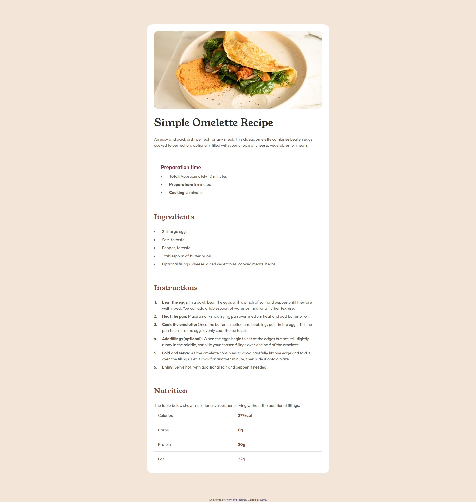

# Frontend Mentor - Recipe page solution

This is a solution to the [Recipe page challenge on Frontend Mentor](https://www.frontendmentor.io/challenges/recipe-page-KiTsR8QQKm). Frontend Mentor challenges help you improve your coding skills by building realistic projects. 

## Table of contents

  - [Screenshot](#screenshot)
  - [Links](#links)
  - [Built with](#built-with)
  - [Continued development](#continued-development)
  - [Author](#author)

### Screenshot

### Links

- Solution URL: [Click here](https://github.com/kauevecchia/recipe-page)
- Live Site URL: [Click here](https://kauevecchia.github.io/recipe-page/)

### Built with

- HTML5
- CSS3
- CSS Grid
- Media Query
- Flexbox

### Continued development

In this challenge i had some troubles, and had to search for the solutions, so im not comfortable with my flexbox and css grid abilities yet, im going to keep studying about this and improve mainly my css abilities.

## Author

- Website - [Kauê](https://github.com/kauevecchia)
- Frontend Mentor - [@kauevecchia](https://www.frontendmentor.io/profile/kauevecchia)

